### Hexlet tests and linter status:
[](https://github.com/dobro10k2/devops-engineer-from-scratch-project-318/actions)

# Bulletin Board Observability Infrastructure

---

## 📌 Project Overview

Infrastructure for the **Bulletin Board application** built as part of the **Hexlet DevOps Engineer from Scratch program**.

The project provides:

* automated deployment via **Ansible**
* containerized runtime (**Docker**)
* observability stack (**Prometheus + Grafana + Loki**)
* alerting via **Telegram**
* centralized logging (**Loki + Promtail**)

---

## 🌐 URLs

| Service     | URL                             |
| ----------- | ------------------------------- |
| Application | https://board.dobro10k2.ru      |
| Grafana     | https://grafana.dobro10k2.ru    |
| Prometheus  | https://prometheus.dobro10k2.ru |

---

## 🖥 Infrastructure

### Servers

| Role       | Description                     |
| ---------- | ------------------------------- |
| App server | application + nginx + exporters |
| Monitoring | prometheus + grafana + loki     |

---

## 🔌 Ports

### Public

* 22 — SSH
* 80 — HTTP
* 443 — HTTPS

### Internal

* 9090 — application metrics
* 9100 — node_exporter
* 3000 — Grafana
* 3100 — Loki
* 9113 — nginx exporter

---

## 🔐 Secrets

All secrets are stored in:

```
ansible/group_vars/all/vault.yml
```

Includes:

* database credentials
* MinIO keys
* Grafana admin password
* Telegram bot token

---

# 🚀 Deployment from scratch

## 1. Clone repository

```
git clone <repo>
cd devops-engineer-from-scratch-project-318
```

---

## 2. Create vault password file

```
echo "your_password" > .vault_pass
chmod 600 .vault_pass
```

---

## 3. Install dependencies

```
pip install ansible ansible-lint
ansible-galaxy collection install -r ansible/requirements.yml
```

---

## 4. Configure inventory

```
ansible/inventory.ini
```

---

## 5. Initial deployment

```
make setup
```

---

## 6. Deploy new version

```
make deploy
```

---

## 7. Rollback

```
make rollback TAG=<docker_tag>
```

---

# 🧪 Testing & Validation

## Lint

```
make lint
```

## Syntax check

```
make test
```

## Smoke tests

```
make smoke
```

Smoke tests check:

* application availability
* Prometheus health
* Grafana availability
* metrics endpoint

---

# 📊 Monitoring

## Metrics sources

* application → `/actuator/prometheus`
* node_exporter
* nginx exporter

---

## Prometheus

```
https://prometheus.dobro10k2.ru
```

Check:

```
up == 1
```

---

## Grafana

```
https://grafana.dobro10k2.ru
```

Login:

```
admin
```

Password is stored in Vault.

---

## Dashboards

| Dashboard           | Description           |
| ------------------- | --------------------- |
| Status Page         | overall system health |
| System Metrics      | CPU, RAM, disk        |
| Application Metrics | RPS, latency          |
| HTTP Metrics        | status codes          |
| Nginx Metrics       | connections           |
| Logs Overview       | logs from Loki        |

---

# 🚨 Alerting

Configured via Grafana provisioning.

## Alerts

* Application Down
* High CPU (>80%)
* High Memory (>80%)
* Disk Almost Full
* No Metrics
* High 5xx rate
* Log-based alerts (Loki)

---

## Notifications

* Telegram Bot API

---

## How to trigger alerts

### Application down

```
docker stop <app_container>
```

### High CPU

```
yes > /dev/null
```

### 5xx errors

```
curl https://board.dobro10k2.ru/invalid-endpoint
```

---

# 📜 Logs (Loki + Promtail)

## Architecture

```
Application / Nginx
        ↓
Promtail
        ↓
Loki
        ↓
Grafana
```

---

## Log sources

* `/var/log/nginx/access.log`
* `/var/log/nginx/error.log`
* application logs (Docker)

---

## Loki endpoint

```
http://localhost:3100
```

---

## Example queries

```
{job="nginx"}
```

```
{job="nginx"} | json | status >= 500
```

```
{job="app"} |= "ERROR"
```

---

# 🔍 Manual Verification

1. Open application

2. Open Grafana

3. Verify dashboards:

   * metrics present
   * logs present

4. Trigger alert

5. Verify:

   * alert in Grafana
   * Telegram notification

---

# 📁 Repository Structure

```
.
├── Makefile
└── ansible
    ├── inventory.ini
    ├── playbook.yml
    ├── group_vars
    │   └── all
    │       ├── all.yml
    │       └── vault.yml
    └── roles
        ├── certbot
        ├── docker_deploy
        ├── docker_network
        ├── docker_setup
        ├── firewall
        ├── minio
        ├── monitoring
        ├── nginx
        ├── postgres
        └── node_exporter
```

---

# 🖼 Screenshots

### System Metrics

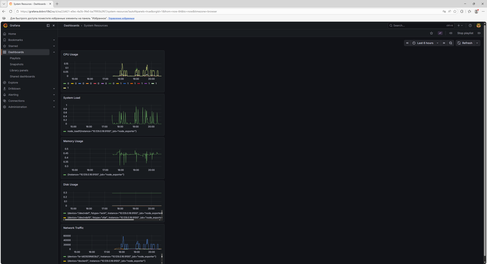

### Application Metrics

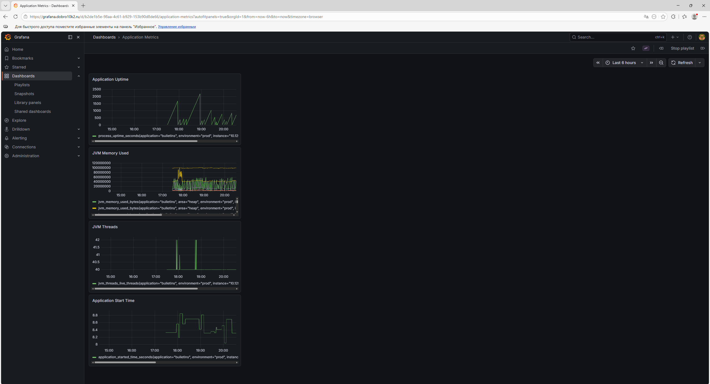

### HTTTP Metrics

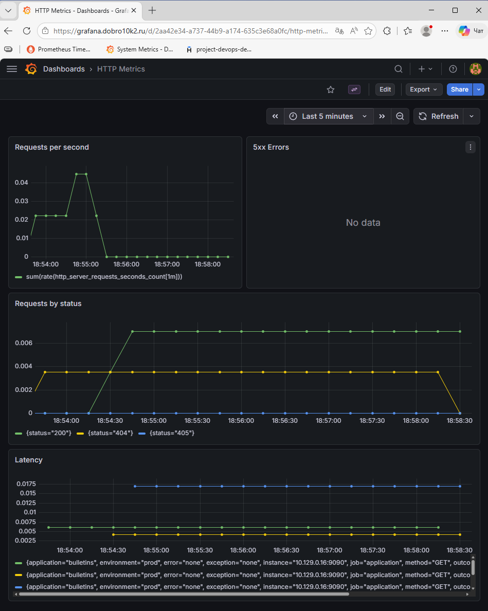

### Nginx Metrics

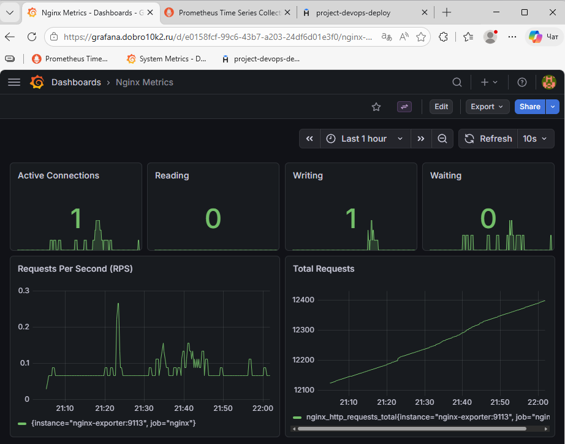

### Status Page

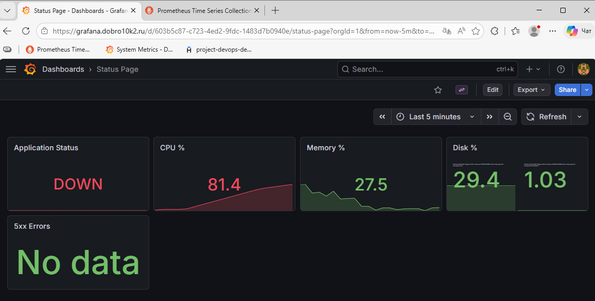

### Prometheus Targets

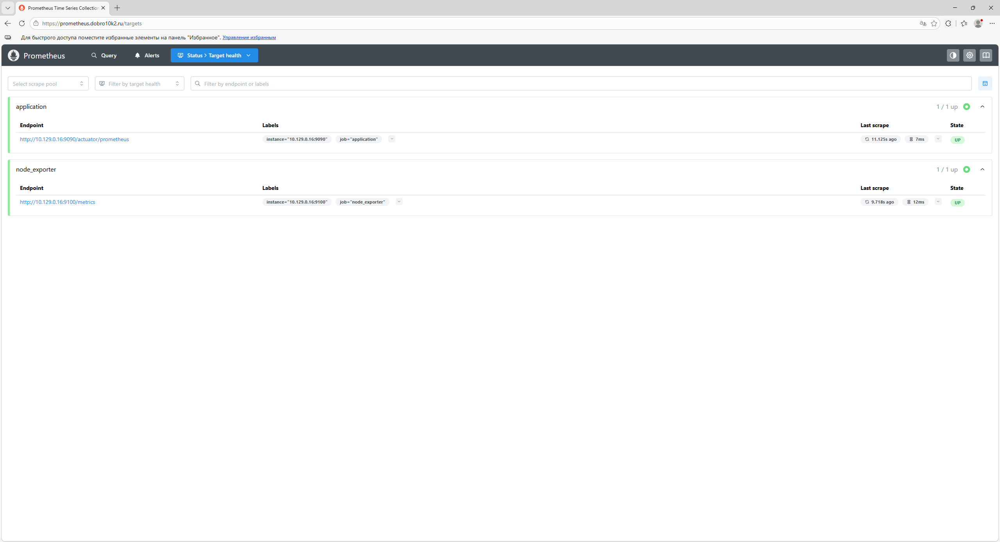

### Alert Fired

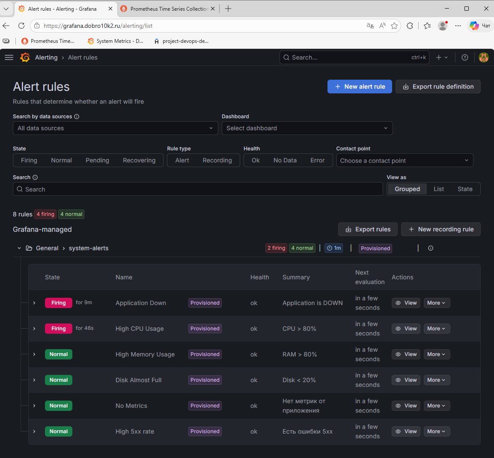
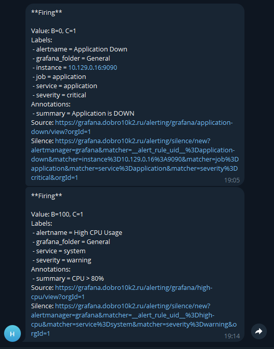

### 5xx Errors

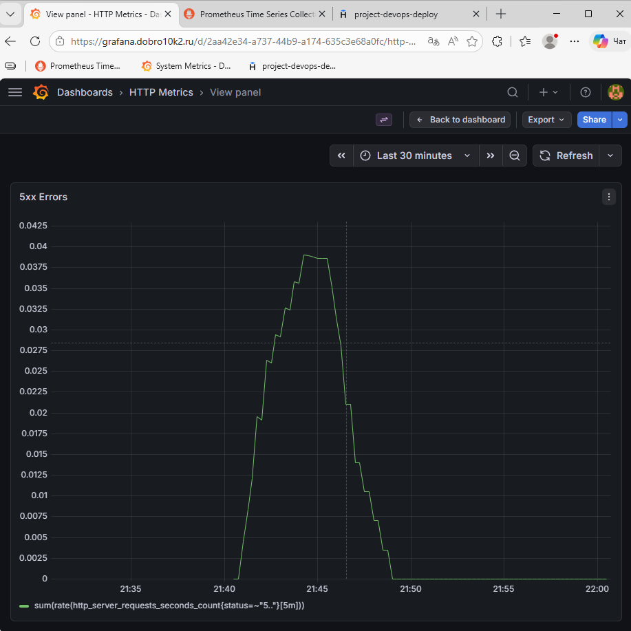

### Prometheus 5xx Errors

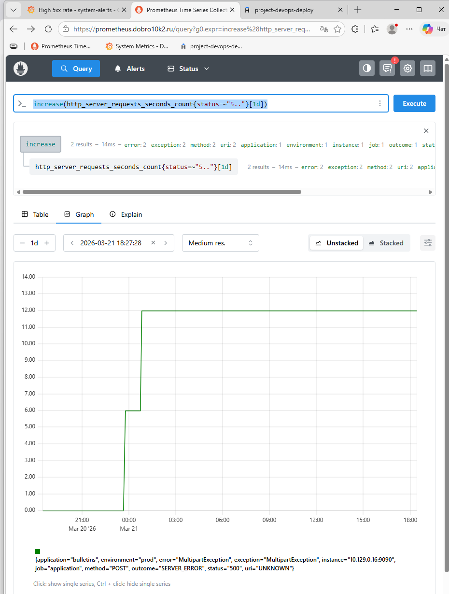

### Logs in Explore

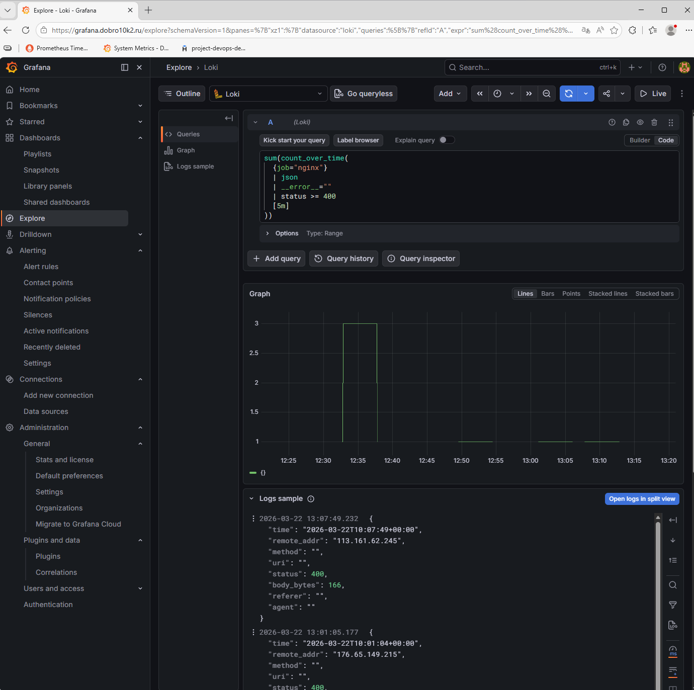

### Logs Dashboard

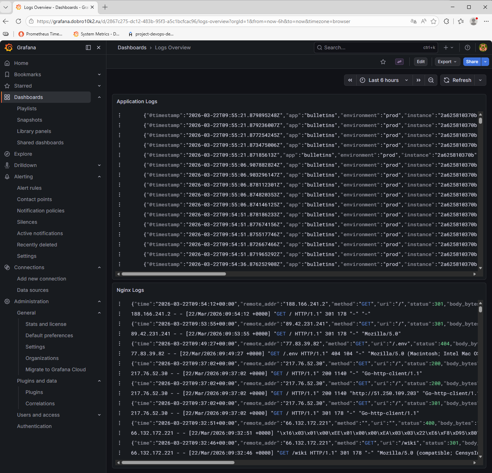

### Log Alert Rules

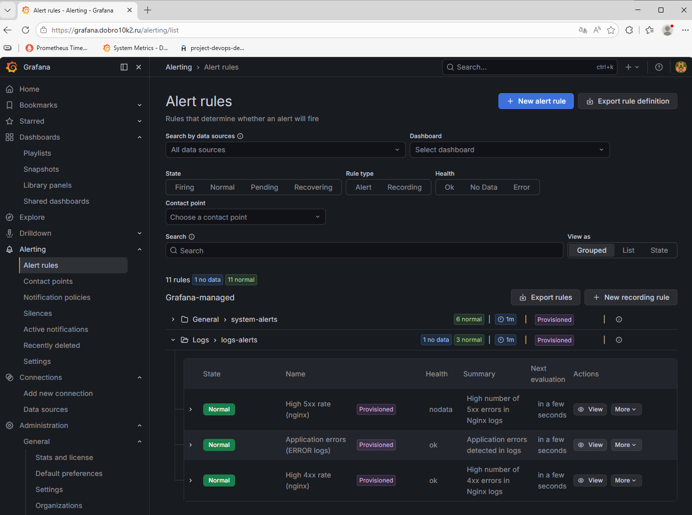

---

# ✅ Conclusion

The project implements a full observability stack:

* metrics collection (Prometheus)
* visualization (Grafana)
* centralized logging (Loki)
* alerting (Telegram)

Infrastructure is:

* reproducible
* idempotent
* validated via lint and smoke tests

---

# 📌 Notes

* All secrets are stored in Ansible Vault
* Infrastructure is fully reproducible using Makefile
* Ansible playbooks pass `ansible-lint` (production profile)

